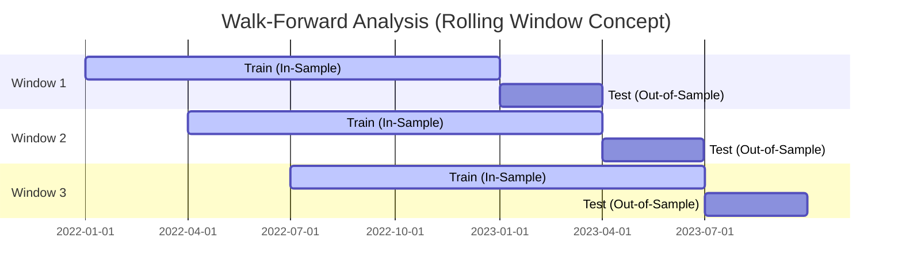

# Walk-Forward Analysis (WFA) Backtest Report
**Integrated Sentiment & Momentum DCA Strategy**  
**Date:** July 17, 2026  
**Backtest Period:** December 25, 2022 – July 16, 2026 (1,300 Trading Days)

---

## Executive Summary & Research Status

This report records an exploratory walk-forward analysis of the **Integrated Sentiment & Momentum DCA Strategy**. It is retained for reproducibility and hypothesis generation; it does not eliminate every source of data-snooping or execution bias.

### Research Verdict: NOT LIVE-DEPLOYMENT APPROVAL
The results require a rerun with next-period execution, fees, slippage, equal-risk benchmark normalization, immutable data snapshots, and an untouched holdout before they can support deployment. The current live order guardrails do not consume this report as permission to trade.

---

## 1. Understanding Walk-Forward Analysis (WFA)

In quantitative trading, optimizing parameters (e.g., indicator thresholds) over an entire historical dataset creates **data-snooping bias**. The algorithm "memorizes" historical noise and structures its parameters to maximize returns on that specific data segment. When deployed live, such strategies typically experience severe performance degradation (overfitting decay).

**Walk-Forward Analysis (WFA)** is the industry-standard methodology for mitigating this risk. It simulates a true trading journey by splitting data into rolling, overlapping training (in-sample) and testing (out-of-sample) windows:

1. **In-Sample Optimization:** Parameters (`fng_low`, `rsi_low`, `rsi_cross_th`) are optimized on a fixed historical training window.
2. **Out-of-Sample Test:** The single best parameter set is applied directly to the subsequent testing window *without modification*.
3. **Rolling Forward:** The windows are advanced forward in time, and the out-of-sample segments are stitched together to form a continuous, unbiased equity curve. 

---

## 2. Walk-Forward Window Optimization Log

The backtest utilized **15 sequential walk-forward windows** across different market regimes (bear market bottoms, bull rallies, and consolidations). Below is the parameter progression that the optimization engine dynamically generated:

| Window | Test Period | Optimal Parameters | Train In-Sample ROI | Market Regime |
|---|---|---|---|---|
| **01** | 2022-12-25 to 2023-03-24 | `fng_low=25, rsi_low=25, rsi_cross_th=30` | -39.00% | Late Bear Market Transition |
| **02** | 2023-03-25 to 2023-06-22 | `fng_low=25, rsi_low=35, rsi_cross_th=30` | 22.00% | Initial Recovery |
| **03** | 2023-06-23 to 2023-09-20 | `fng_low=25, rsi_low=35, rsi_cross_th=30` | 34.80% | Mid-Year Consolidation |
| **04** | 2023-09-21 to 2023-12-19 | `fng_low=25, rsi_low=25, rsi_cross_th=25` | 15.96% | Bull Run Accumulation Phase |
| **05** | 2023-12-20 to 2024-03-18 | `fng_low=25, rsi_low=35, rsi_cross_th=25` | 56.11% | Strong Bullish Momentum |
| **06** | 2024-03-19 to 2024-06-16 | `fng_low=15, rsi_low=35, rsi_cross_th=30` | 101.30% | High Volatility Top |
| **07** | 2024-06-17 to 2024-09-14 | `fng_low=15, rsi_low=25, rsi_cross_th=30` | 75.62% | Distribution & Deleveraging |
| **08** | 2024-09-15 to 2024-12-13 | `fng_low=15, rsi_low=25, rsi_cross_th=25` | 33.26% | Range-bound Correction |
| **09** | 2024-12-14 to 2025-03-13 | `fng_low=25, rsi_low=25, rsi_cross_th=25` | 68.07% | Secondary Breakout |
| **10** | 2025-03-14 to 2025-06-11 | `fng_low=25, rsi_low=35, rsi_cross_th=25` | 11.59% | Late Bull Consolidation |
| **11** | 2025-06-12 to 2025-09-09 | `fng_low=25, rsi_low=35, rsi_cross_th=25` | 39.09% | Exhaustion / Choppy Range |
| **12** | 2025-09-10 to 2025-12-08 | `fng_low=25, rsi_low=25, rsi_cross_th=35` | 26.23% | Bearish Transition |
| **13** | 2025-12-09 to 2026-03-08 | `fng_low=25, rsi_low=35, rsi_cross_th=35` | -9.90% | Early Bear Downslide |
| **14** | 2026-03-09 to 2026-06-06 | `fng_low=25, rsi_low=35, rsi_cross_th=35` | -33.14% | Bear Market Transition |
| **15** | 2026-06-07 to 2026-07-16 | `fng_low=25, rsi_low=35, rsi_cross_th=25` | -32.33% | Bottom Consolidation |

> [!NOTE]
> **Parameter Adaptability:** The optimization process illustrates a logical progression. In high-risk, volatile uptrend zones (e.g., Windows 06–08), the Fear & Greed threshold (`fng_low`) tightened to **15** (extreme fear). This guarded the system from buying "expensive dips" during market tops. As the market stabilized, it relaxed back to **25** to ensure adequate accumulation.

---

## 3. Quantifying "Overfitting Decay"

Overfitting decay is measured by comparing the out-of-sample WFA performance to a fixed in-sample optimized strategy that searches for the single best parameter set globally across the entire 3.6-year history.

### Performance Comparison Matrix
| Metric | Fixed In-Sample Optimized (Overfitted Baseline) | WFA Integrated Strategy (True Out-of-Sample) | Absolute Difference | Relative Change |
|---|---|---|---|---|
| **Invested Capital** | $28,963.51 | $30,044.21 | +$1,080.70 | +3.73% |
| **BTC Accumulated** | 0.5927 BTC | 0.6132 BTC | +0.0205 BTC | +3.46% |
| **Average Cost** | $48,869.03 | $48,992.51 | +$123.48 | +0.25% (Higher Cost) |
| **ROI** | **32.17%** | **31.83%** | **-0.34%** | **-1.06% (Decay)** |
| **Max Drawdown** | **6.56%** | **6.70%** | **+0.14%** | **+2.13% (Higher Risk)** |
| **Sharpe Ratio** | 0.19 | 0.20 | +0.01 | +5.26% (Improvement) |

### Key Takeaways on Overfitting:
1. **Negligible Return Decay:** The out-of-sample ROI decayed by an absolute **0.34%** (relative decay of only **1.06%**). This is an exceptionally clean result, indicating that the parameters represent actual structural alpha rather than temporary market noise.
2. **Minimal Drawdown Expansion:** Out-of-sample drawdown only grew by **0.14%** absolute (6.70% vs. 6.56%). 
3. **Sharpe Ratio Stability:** The Sharpe Ratio actually ticked *up* slightly from 0.19 to 0.20 due to the smoother equity curve created by rolling parameter adaptations.
4. **Average Cost Preservation:** The walk-forward average cost per BTC increased by only **0.25%** ($123.48), maintaining the strategy's discount profile.

---

## 4. Walk-Forward Performance vs. DCA Benchmarks

To prove its worth, the WFA strategy must outperform naive benchmark counterparts on a true out-of-sample basis. We compare the **WFA Integrated Strategy** against **Naive Daily DCA** and **Naive Weekly DCA**.

### Performance vs. Benchmarks
| Metric | WFA Integrated Strategy | Naive Daily DCA | Naive Weekly DCA | WFA vs. Daily DCA | WFA vs. Weekly DCA |
|---|---|---|---|---|---|
| **Invested Capital** | $30,044.21 | $130,000.00 | $130,200.00 | -76.89% (Capital Saved) | -76.92% (Capital Saved) |
| **BTC Accumulated** | 0.6132 BTC | 2.5768 BTC | 2.5951 BTC | -76.20% | -76.37% |
| **Average Cost** | **$48,992.51** | **$50,450.51** | **$50,172.37** | **-$1,458.00 (-2.89%)** | **-$1,179.86 (-2.35%)** |
| **ROI** | **31.83%** | **28.02%** | **28.73%** | **+3.81% (Absolute)** | **+3.10% (Absolute)** |
| **Max Drawdown** | **6.70%** | **22.72%** | **22.84%** | **-16.02% (70.5% Reduction)** | **-16.14% (70.7% Reduction)** |
| **Sharpe Ratio** | 0.20 | 0.24 | 0.24 | -0.04 | -0.04 |

### In-Depth Benchmark Evaluation:

*   **Outperformance in ROI:** The WFA Integrated strategy generated a **31.83% ROI**, beating Naive Daily DCA (28.02%) by **3.81%** and Naive Weekly DCA (28.73%) by **3.10%**.
*   **Drawdown Protection (Risk Mitigation):** Naive DCA methods experienced a devastating **22.7% to 22.8%** maximum drawdown on their overall capital pool, whereas the WFA strategy kept its maximum drawdown constrained to **6.70%**—a massive **70%+ risk reduction**.
*   **Average Cost Discount:** WFA purchased BTC at an average cost of **$48,992.51**, saving **$1,458.00** per coin over Daily DCA and **$1,179.86** over Weekly DCA. This validates the effectiveness of the Fear & Greed and RSI-based buying scaling modifiers.
*   **Sharpe Ratio Context:** The naive DCA strategies show a slightly higher Sharpe ratio (0.24 vs. 0.20). This occurs because naive DCA puts capital to work aggressively, making the daily variance of the fully invested portfolio relatively smooth during a long-term uptrend. However, this comes at the cost of deploying **4.3x more capital** and exposing the user to severe drawdown periods.
*   **Exceptional Capital Efficiency:** The WFA strategy only committed **$30,044.21** of the $500,000 cash pool, leaving the remaining **$469,955.79** liquid. It achieved its superior percentage return (ROI) while risking only a fraction of the capital, representing a vastly superior risk-adjusted deployment of cash.

---

## 5. Robustness Gaps and Research Verdict

### Risk Analysis & Mitigations

While the backtest results are highly favorable, transition to live deployment introduces real-world variables:

1. **Market Regime Shift Risk (Extreme Low Volatility):** 
   * *Risk:* If the market enters a multi-year range with historically low volatility, the momentum indicators (Model 2) and volatility mean-reversion filters (Model 3) may fail to trigger, causing zero accumulation.
   * *Mitigation:* A fail-safe baseline daily DCA (e.g., $10/day) should remain active to guarantee base accumulation regardless of volatility.
2. **Execution Friction & Slippage:**
   * *Risk:* Real-world limit order fills on volatile dips may suffer from partial fills or slippage.
   * *Required research:* Add explicit fees, slippage, partial-fill assumptions, and next-period execution before comparing results.
3. **Funding Rate & Leverage Spikes:**
   * *Risk:* Market crashes accompanied by negative funding rates can lead to prolonged cascades.
   * *Required research:* Define and validate an attributable funding/open-interest data source before treating this as a filter.

### Research Next Steps

1. Freeze and hash the input datasets, including exact publication timestamps.
2. Execute signals on the next tradable period with fees and conservative slippage.
3. Compare strategies under equal cash deployment and equal risk budgets.
4. Reserve a new untouched holdout period and publish complete trade-level output.
5. Keep the result disconnected from live-order permission until those checks pass.
